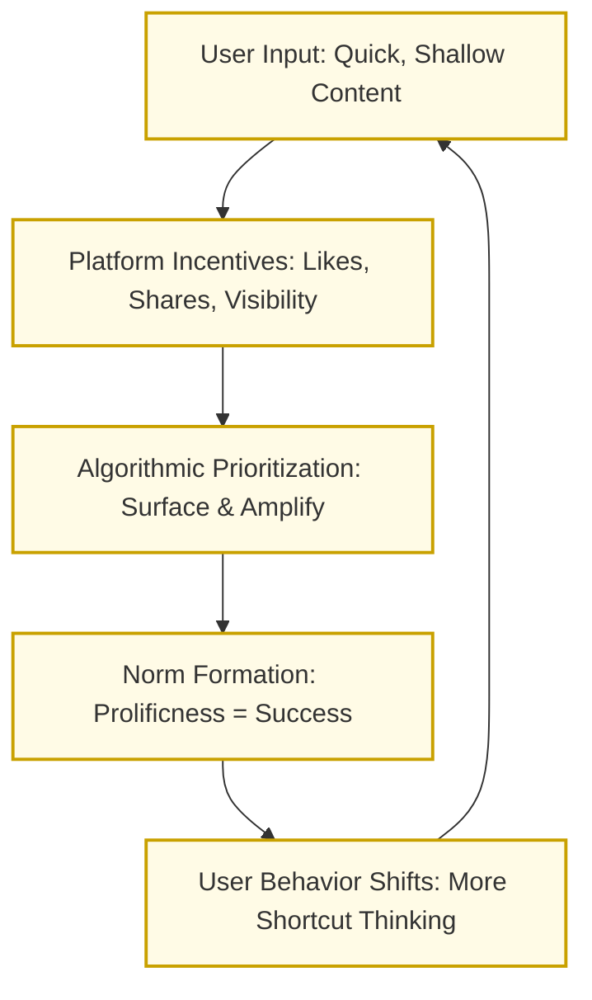

## 2. The Architecture of Avoidance
{: .no_toc }

## Table of Contents
{: .no_toc .text-delta }

- TOC
{:toc}

### 2.0 What's Avoided at Scale

Poet [Andrew Choate](https://andrewchoate.us/) holds up a mirror at an angle that flatters few:

> Is it lazier to make a big thing, make a lot of things, or to make a small thing, not very much?
There's certainly an aura—perhaps even a suspicion—of laziness in prolificness.
>

Choate's insight is more than artistic musing—it touches something structural. In this framing, laziness isn't about the amount of visible effort—how prolific or energetic someone appears—but about the effort that's systematically avoided: the harder, slower work of cognitive depth—like tracking internal consistency across ideas, integrating perspectives, or wrestling with moral consequences. A person who constantly produces is not thinking hard enough.

Reasoning is expensive biologically[^1]: it draws heavily on focus, memory, and effortful synthesis. What's avoided depends on the person and context—attention span, cognitive bandwidth, platform norms, and even educational background. People think just well enough to get by most of the time, which is to say, we don't think well often.

In the digital realm, the collective result of these savings is hard to miss even for a budget observer. The concept of *productive laziness* scales perfectly to the Internet, where prolificness dominates—across users who favor immediacy over depth, across platforms that amplify volume over structure, and across time as habits solidify into norms. We churn out tweets, comments, videos, and threads—creative, at times, but rarely cumulative. They seldom connect, challenge, or extend ideas in ways that build reasoning[^2]. Entranced in sweaty pursuit of algorithmic incentives and social validation, we don't resist the omission.

Because reasoning is costly and platforms are optimized for metabolic thrift (privileging ease, speed, and volume), deeper forms of thought get displaced. Individual shortcuts are just that, but how the system responds to them invites scrutiny. The more we reward rapid, prolific contributions, the more those patterns dominate—and the more algorithms tune themselves to those patterns in turn. Poor reasoning isn't just common; it's reinforced. A positive feedback loop emerges: lazy thinking gets surfaced, incentivized, copied, and rewarded, until it becomes the baseline rhythm of public discourse. What's avoided at scale becomes not just a personal lapse, but a structural erosion—a thinning of what holds thought together. Like a microphone too close to a speaker, the system begins to amplify its distortion.

*Figure: The Reasoning Feedback Loop.*

And so, the Internet has grown vast and expressive—yet hollowed of connective logic[^3]. This didn't happen by decree—it emerged through a kind of ambient laziness: the positive feedback loop of systematic deferral of slow, effortful thought.

### 2.1. The Decline Question

We are taking a stroll among big ideas and dramatic questions, and here it's paramount to walk past the wrong ones. I am reminded of a story that the legendary composer John Cage told in [_Indeterminacy_](https://www.lcdf.org/indeterminacy/s/49?var=s):
>After the concert I was walking along with the composer and he was telling me how the performances had not been quite up to snuff. So I said, "Well, I enjoyed the music, but I didn't agree with that program note about there being too much pain in the world. He said, "What? Don't you think there's enough?" I said, "I think there's just the right amount".

Cage's provocation points out that saying “too much suffering” begs the question: relative to what ideal, what baseline, and by what mechanism are we measuring? This is precisely the kind of ambiguity that should give us pause before declaring reasoning in decline, whether due to platforms or anything else.

Many critiques of modern discourse, from social media to political polarization, carry a background hum of nostalgia: the sense that people *used to think better*.

But _as a diagnostic_, it's deeply fraught. Measuring “reasoning” is hard enough. Comparing it across platforms, eras, and populations is harder still. What's the unit of analysis? A syllogism? A thread? A voter base? A classroom? Should we weigh visibility, frequency, coherence, and influence? There's no natural denominator—and no stable point of reference.

Worse, the question may not even be consequential. Suppose we knew that the *average quality of public reasoning* had declined. What exactly would follow? Our task would still be to improve it. Or suppose reasoning had *increased*, but become less discoverable amid digital noise. That, too, would call for new tools and better infrastructure.

We are looking to side-step the irony of dedicating the previous chapter to the sorry state of the online discourse, and avoid the descent into helpless lament. Rather than ask whether reasoning has declined, we prefer to ask: how can we support more of it, in more places, with less friction and more uptake?

We're dissatisfied with the current reasoning environment, but we also see in it a challenge that lends itself, at least in part, to architectural solutions.

### 2.2 A Fork in the Feedback

The rise of large language models adds a new layer of complexity to the landscape we've just described. LLMs are trained on the same public discourse that platforms already distort—language shaped by speed, ambiguity, persuasion, and prolificness. So it's reasonable to worry that they might amplify the positive feedback loop we've traced: reproducing shallow reasoning, reinforcing its patterns, and accelerating its spread[^4].

But amplification is not an inevitability. While LLMs inherit the ambiguity and rhetorical shortcuts of human language, their behavior is shaped as much by architecture as by data. Prompt structures, interaction design, system incentives, and delivery context all influence what kind of reasoning they surface or suppress. In the wrong configuration, they amplify fallacies. But in the right one, they could help users notice what's missing, slow down when it matters, and build with more structure. The challenge isn’t to perfect reasoning, but to scaffold it—to make its presence more visible, its absence harder to miss, and its structure easier to sustain.

FallacyTag is one such attempt—but it's not offered as proof of concept for the broader thesis. If it fails to change behavior or improve discourse, that outcome wouldn't undermine the core claim: that reasoning can be shaped architecturally[^5]. It might only mean this particular design—or this moment—wasn't the right match. What matters is the direction of inquiry: building systems that make reasoning easier to see, to question, and to improve. If we can design for attention, we'd better design for reasoning.

----

[Previous](/fallacytag/pages/01-what-you-are-reading/){: .btn } [Next](/fallacytag/pages/03/03-scaffolded-intelligence/){: .btn }

----

[^1]: Deliberate reasoning draws heavily on attention, memory, and executive control. Psychologists describe it as System 2 thinking—slow and effortful, unlike our fast, intuitive defaults ([Stanovich & West 2000](https://doi.org/10.1017/S0140525X00003435); [Kahneman 2011](https://en.wikipedia.org/wiki/Thinking,_Fast_and_Slow)). Neuroscience shows it activates resource-intensive brain areas like the prefrontal cortex ([Baddeley 2000](https://academic.oup.com/book/10453)), while cognitive load theory explains why unfamiliar reasoning tasks quickly overwhelm us ([Sweller 1988](https://doi.org/10.1207/s15516709cog1202_4)). Evolutionary accounts argue that reasoning is selectively deployed—used when the stakes justify the energy cost, especially in social argument ([Mercier & Sperber, 2011](https://doi.org/10.1017/S0140525X10000968); [Lieder & Griffiths 2020](https://doi.org/10.1017/S0140525X1900061X)). Early studies have even tied sustained reasoning to glucose depletion ([Gailliot et al. 2007](https://doi.org/10.1037/0022-3514.92.2.325)) or, more recently, subjective fatigue ([Kurzban et al. 2013](https://doi.org/10.1017/S0140525X12003196)).

[^2]: Online discourse is often expressive or creative but rarely builds cumulative reasoning—a claim supported by multiple empirical studies. On Facebook, [Del Vicario et al. (2016)](https://www.pnas.org/doi/10.1073/pnas.1517441113) showed that users interact primarily within ideological echo chambers, where emotionally resonant content spreads more effectively than deliberative argument. [Singer et al. (2016)](https://arxiv.org/abs/1604.06899) indicate diminished reasoning quality over time  on Reddit, suggesting that platform interaction fails to reinforce sustained, cumulative reasoning. [Aragón et al. (2017)](https://arxiv.org/abs/1707.06526) note that drifting threads and ignored comments result from poor structuration of argument flow. [Shortall et al. (2021)](https://arxiv.org/abs/1707.06526) observe that digital platforms often degrade discussion quality when attempting to scale deliberation and highlight the scarcity of design features that support argument accumulation, critical thinking, and structured reasoning. Collectively, these studies suggest that while digital platforms facilitate creative participation, they seldom reward or reinforce the kind of reasoning that accumulates across exchanges.

[^3]: We are aware of pockets of better reasoning on the Internet: longform forums, commentaries, Substacks, or collaborative writing spaces. The focus of this section is on what gets surfaced and rewarded at scale. The next section (2.1)  explains that we are not interested in the authoritative grading of the Internet.

[^4]: Large language models may amplify fallacious reasoning if not carefully constrained. Studies have found that while LLMs can identify certain fallacies, they often misclassify, overlook, or even generate flawed arguments, particularly in nuanced or ambiguous cases. For example, [Teo et al. (2025)](https://doi.org/10.1007/978-981-96-8197-6_29) reported high variability in LLM fallacy classification performance, especially with intent-dependent types such as *intentional* or *equivocation*. Similarly, [Manickavasagam & Bandara (2025)](http://dx.doi.org/10.1007/978-3-031-90341-0_4) noted that even with prompting and fine-tuning, models struggle with interpretive ambiguity. External evaluations have shown that LLMs frequently generate persuasive but fallacious content in argument tasks unless guided by structured reasoning constraints ([Ji et al., 2023](https://doi.org/10.1145/3571730)).

[^5]: Several platforms exemplify how architectural design can scaffold cumulative reasoning online. [Kialo](https://www.kialo.com/) structures debates via branching pro/con argument maps, which multiple (self-promoted but seemingly independent) [educational studies and documentation](https://www.kialo-edu.com/research) show improve critical thinking, clarity, and engagement. [Pol.is](https://pol.is/) uses clustering algorithms to surface cross-cutting consensus, and its deployment in Taiwan’s vTaiwan platform has led to real policy outcomes ([vTaiwan case study](https://congress.crowd.law/files/vtaiwan-case-study.pdf); [The Computational Democracy Project case studies](https://compdemocracy.org/Case-studies/)). [LiquidFeedback](https://liquidfeedback.com/) supports structured proposition development, integrated deliberation and voting, and delegative democracy mechanisms used by the German Pirate Party ([Kling et al., (2015)](https://arxiv.org/abs/1503.07723)) and other civic groups ([Behrens et al., 2014](https://liquidfeedback.com/pub/The_Principles_of_LiquidFeedback_1st_edition_online_version.pdf)). These platforms illustrate that, with intentional architectural design, online reasoning can indeed accumulate meaningfully across exchanges.
